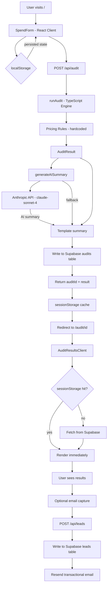

# ARCHITECTURE.md

## System Diagram

## Data Flow: Input → Audit Result

1. **User fills form** — tool selections, plan IDs, seat counts, monthly spend, team size, use case
2. **localStorage persistence** — form state saved on every change, restored on reload
3. **POST /api/audit** — validated input, rate-limited by IP (10/hour in-memory)
4. **Audit engine** — pure TypeScript, zero external calls, O(n) over tool list
   - Per-tool rules evaluate plan fit, seat count appropriateness
   - Cross-tool redundancy rules run after per-tool (e.g., Cursor + Copilot)
   - Recommendations sorted by severity (critical → warning → info → ok)
5. **AI summary** — single Anthropic API call with structured prompt; falls back to template on failure
6. **Supabase write** — non-blocking; audit renders even if DB write fails
7. **Redirect to /audit/[id]** — result cached in sessionStorage for instant render
8. **Shareable URL** — server component generates OG metadata from Supabase record

## Stack Choices

**Next.js 14 (App Router)**
Required SSR for proper Open Graph metadata generation on `/audit/[id]` pages. API routes colocated with the frontend simplified deployment. Vercel deploy is zero-config.

**TypeScript throughout**
The audit engine has complex rule logic. TypeScript's discriminated unions on `ToolId` and `SeverityLevel` prevented entire classes of bugs (wrong tool ID strings, missing cases).

**Supabase (Postgres)**
Free tier handles ~50k rows. Row-level security prevents unauthorized reads of lead emails. The `audits` table is public-readable (tools + savings, no PII) to support shareable URLs. The `leads` table is private.

**Resend**
Cleanest DX for transactional email. Free tier (100 emails/day) covers MVP launch. React Email templates would be a week-2 addition.

**Tailwind**
Utility-first enabled the editorial design (custom color palette, precise spacing) without a component library's opinionated defaults. The design borrows from editorial print — `Playfair Display` serif headlines, `DM Mono` for data, generous white space.

**No auth**
Spec required no login. Lead emails are the only PII collected, stored in a private Supabase table. Shareable audit URLs strip email/company before generating the public link.

## Scaling to 10k Audits/Day

Current bottlenecks and fixes:

| Bottleneck | Fix |
|-----------|-----|
| In-memory rate limiting resets on deploy | → Upstash Redis (10k requests/day free) |
| Supabase free tier row limits | → Supabase Pro ($25/mo) handles millions of rows |
| Anthropic API latency (~1-2s per summary) | → Queue summaries async, show "Generating summary…" placeholder |
| No CDN caching on audit pages | → Add `cache-control: public, s-maxage=3600` headers on static audit pages |
| Single Vercel function | → Already serverless; auto-scales. No change needed. |

At 10k audits/day, the real cost is Anthropic API: ~$0.003/summary × 10k = $30/day. At that scale, implement summary caching: hash the tool inputs, cache identical stacks for 24 hours.
